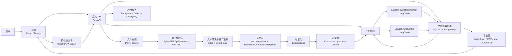

# 系统架构总览

版本：v0.2

日期：2026-07-20

## 目标

这份文档回答三个问题：

1. 整个产品的技术栈怎么分层。
2. 每一层分别负责什么。
3. 为什么这个程序只做引用审计，而不做综述生成和编辑。

产品核心闭环：

```text
上传 PDF
-> 解析与切块
-> 证据卡片
-> 待检查文本
-> claim 级引用审计
-> 导出
```

## 总体分层

```text
用户界面层
应用服务层
文档处理层
检索与向量层
LLM 编排层
审计与导出层
存储与安全层
```

## 架构图



## 模块职责

| 模块 | 技术 | 负责内容 |
|---|---|---|
| 前端 | React / Next.js | 上传 PDF、浏览 evidence cards、提交待检查文本、查看 audit、导出 |
| API 服务 | FastAPI | 提供接口、组织流程、管理项目和论文、触发解析与审计 |
| PDF 处理 | PyMuPDF / pdfplumber / later GROBID | 从 PDF 中抽取正文、页码、章节、参考文献线索 |
| 文本清洗 | 规则 + 版面算法 | 去页眉页脚、合并断行、章节识别、去噪 |
| 切块 | custom section splitter + RecursiveCharacterTextSplitter | 把论文变成语义可检索的小片段 |
| 向量化 | embedding 模型 | 把 chunks / evidence cards 转成向量 |
| 向量库 | Chroma / pgvector / Qdrant | 存储向量，支持相似检索和 metadata 过滤 |
| 编排 | LangChain LCEL | 串联 evidence extraction、citation audit、polish audit |
| 后台任务 | BackgroundTasks / Celery / RQ | 处理上传解析、批量抽取、长时间审计 |
| 结构化存储 | SQLite / PostgreSQL | 保存 Paper、Chunk、EvidenceCard、Claim、AuditResult |
| 导出 | Markdown / CSV / later DOCX/PDF | 导出审计报告、引用台账和证据清单 |

## 为什么不用“大模型读整篇 PDF”

原因很简单：

1. 成本高。
2. 稳定性差。
3. 隐私风险大。
4. 不利于做引用可追溯。

所以我们刻意把系统设计成：

```text
PDF 解析靠传统解析器
文本清洗靠规则和版面逻辑
检索靠 embedding + vector store
LLM 只看候选证据片段
审计只在 claim 级做判断
```

## 前端层

技术：

```text
React / Next.js
```

负责：

1. 项目管理。
2. PDF 上传和状态展示。
3. Evidence board。
4. 待检查文本提交区。
5. Audit panel。
6. 导出入口。

前端承载的是一个“证据工作台”：

```text
左侧：论文 / 证据
中间：待检查文本
右侧：claim 级审计结果和原文 quote
```

## 后端服务层

技术：

```text
FastAPI
```

负责：

1. 接收上传请求。
2. 创建项目、论文和待检查文本记录。
3. 触发解析、evidence extraction、audit。
4. 管理权限、日志和隐私模式。

## PDF 处理层

技术：

```text
PyMuPDFLoader
PDFPlumberLoader
later GROBID
```

负责：

1. 读取 PDF。
2. 提取页码和正文。
3. 尽量识别章节。
4. 保留原文和位置信息。

## 文本清洗与切块层

技术：

```text
规则清洗
section splitter
RecursiveCharacterTextSplitter
```

负责：

1. 去掉页眉页脚、断行和乱码。
2. 把论文按章节拆分。
3. 在章节内部再切成适合检索的 chunks。

## 向量与检索层

技术：

```text
Embeddings
Chroma
later pgvector / Qdrant
```

负责：

1. 为 chunks 和 evidence cards 生成向量。
2. 根据 claim 检索候选证据。
3. 根据 metadata 过滤 paper_id、section_type、project_id。

## LangChain 编排层

技术：

```text
LangChain LCEL
later LangGraph
```

负责：

1. EvidenceExtractionChain。
2. CitationAuditChain。
3. PolishAuditChain。

这里的原则是：LangChain 负责流程编排，不负责替我们生成整段综述正文。

### EvidenceExtractionChain

作用：

把原文 chunk 提炼成“能拿来做引用核查”的结构化证据卡。

### CitationAuditChain

输入：

```text
claim
cited papers
candidate evidence
```

输出：

```text
support level
risk flags
suggested fix
```

作用：

判断“这句话是不是被这些引用真正支持”。

## 存储层

技术：

```text
MVP: SQLite
later: PostgreSQL
```

负责：

1. 保存项目。
2. 保存论文元数据。
3. 保存 chunks。
4. 保存 evidence cards。
5. 保存待检查文本、claim 和 audit result。

## 后台任务层

技术：

```text
MVP: FastAPI BackgroundTasks
later: Celery / RQ
```

负责：

1. PDF 解析。
2. 批量 evidence extraction。
3. 批量 citation audit。
4. 长时间导出任务。

## 导出层

技术：

```text
Markdown
CSV
later DOCX / PDF
```

负责：

1. 导出 evidence card 列表。
2. 导出 audit report。
3. 导出 citation ledger。
4. 导出待检查文本与 claim 映射。

## 当前结论

这套栈的职责很清楚：

```text
传统工具负责解析
向量系统负责找证据
LangChain 负责串流程
LLM 负责抽取和判断
数据库负责可追溯
前端负责把证据链展示给用户
```
