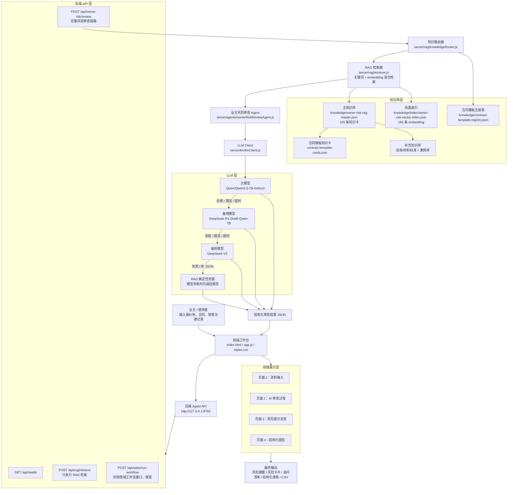
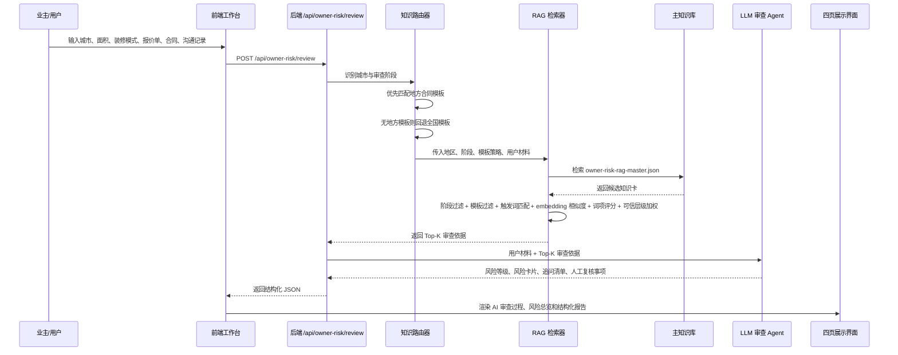
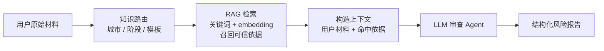
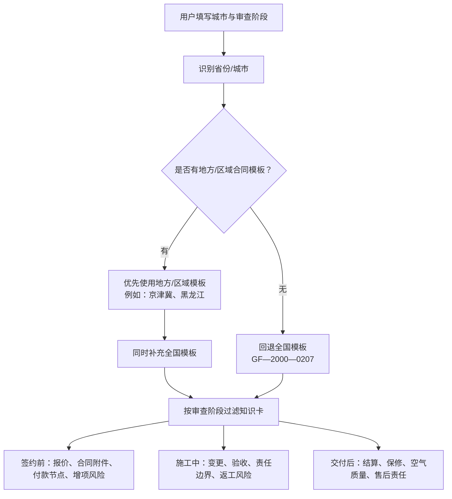
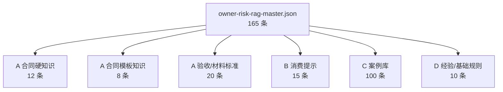
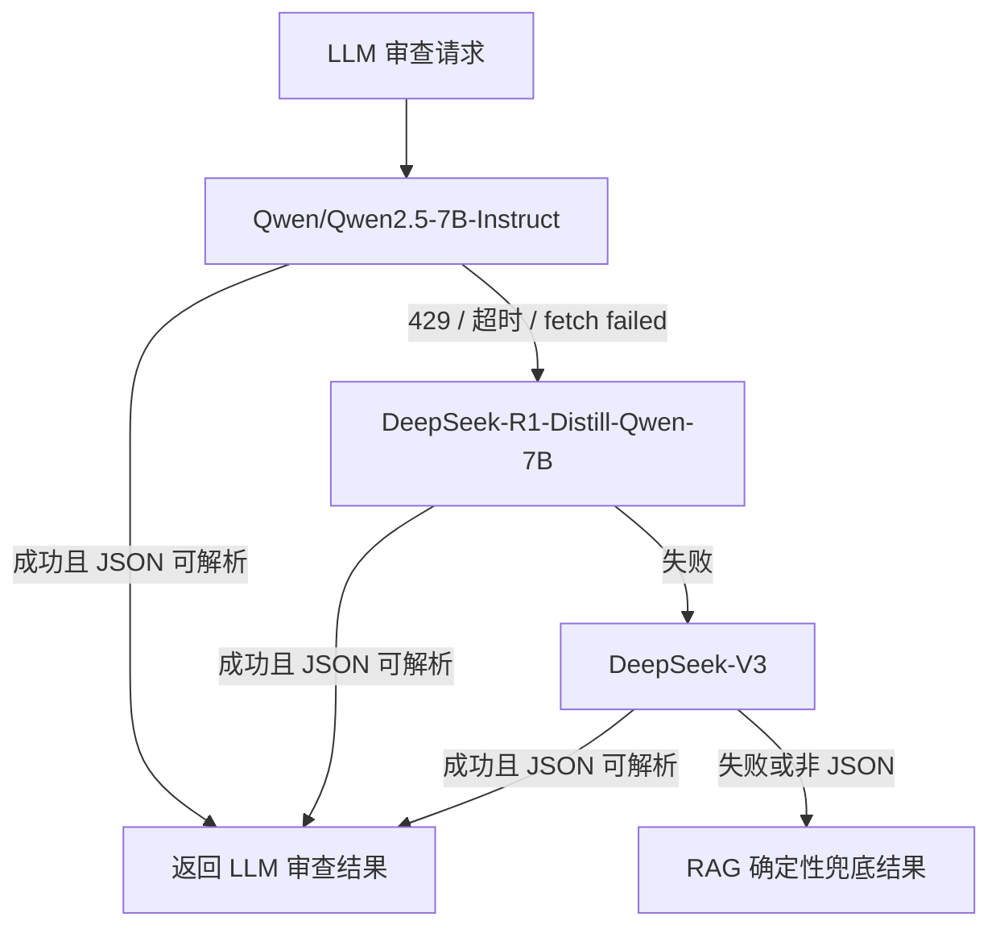

# 当前项目架构图：业主装修签约前 RAG 风险审查助手

生成时间：2026-07-10

当前项目已经从早期“前端规则 + 本地知识库展示”推进为：

> **前端输入 → 后端 RAG 检索 → LLM 风险审查 Agent → 结构化风险报告 → 前端展示**

这份文档只描述当前代码中的真实实现，不描述理想设想。

---

## 1. 当前整体架构图



---

## 2. 当前 RAG 审查主流程图



---

## 3. RAG 与 LLM 的真实关系

当前项目中，RAG 和 LLM 不是两条并列线，而是串联关系：



也就是说：

```text
RAG 不是单独输出结论。
RAG 负责把合同模板、消费提示、案例经验、验收标准等依据找出来。
LLM 再基于这些依据生成风险解释、追问清单和人工复核事项。
```

---

## 4. 知识库路由逻辑



当前示例：

| 用户所在地 | 当前策略 |
| --- | --- |
| 北京 / 天津 / 河北 | 京津冀示范文本 + 全国模板 |
| 黑龙江 / 哈尔滨等 | 黑龙江地方模板 + 全国模板 |
| 杭州 / 广州等暂无地方模板城市 | 全国模板 |

---

## 5. 知识库分层

当前前端和后端共同使用主库：

`knowledge/owner-risk-rag-master.json`

总计 165 条知识卡。



每条知识卡现在都带有：

| 字段 | 作用 |
| --- | --- |
| `origin_file` | 追溯来自哪个源文件 |
| `source_tier` | A/B/C/D 可信层级 |
| `source_bucket` | 合同硬知识、合同模板知识、消费提示、案例库等具体分类 |
| `applicable_stages` | 适用签约前、施工中还是交付复核 |
| `template_id` | 对应哪个合同模板 |

当前向量索引：

| 文件 | 说明 |
| --- | --- |
| `knowledge/index/owner-risk-vector-index.json` | 165 条知识卡的 embedding 向量索引 |
| `server/llm/embeddingClient.js` | embedding 生成客户端 |
| `scripts/build-vector-index.js` | 向量索引构建脚本 |

---

## 6. 模型调用与降级链路

当前后端模型配置：

```text
主模型：Qwen/Qwen2.5-7B-Instruct
备用 1：deepseek-ai/DeepSeek-R1-Distill-Qwen-7B
备用 2：deepseek-ai/DeepSeek-V3
最终兜底：RAG 确定性审查
```



这意味着：

- 模型拥堵时不会导致系统崩溃
- 输出不是严格 JSON 时不会导致页面报错
- 最坏情况下仍然可以基于 RAG 命中依据生成风险报告

---

## 7. 当前代码模块对应关系

| 层级 | 文件 | 作用 |
| --- | --- | --- |
| 前端页面 | `index.html` | 四页工作台结构 |
| 前端交互 | `app.js` | 表单提交、接口调用、结果渲染、CSV 导出 |
| 前端样式 | `styles.css` | 风险审查工具 UI 样式 |
| API 服务 | `server/agent-server.js` | 暴露 health、RAG 检索、业主风险审查等接口 |
| 知识路由 | `server/rag/knowledgeRouter.js` | 城市识别、合同模板选择、阶段过滤 |
| RAG 检索 | `server/rag/retriever.js` | Top-K 依据召回、关键词 + embedding 混合打分、证据卡生成 |
| 风险审查 Agent | `server/agents/ownerRiskReviewAgent.js` | 将用户材料和 RAG 依据交给 LLM，生成结构化审查结果 |
| LLM 客户端 | `server/llm/llmClient.js` | 调用硅基流动/OpenAI-compatible 模型，支持降级 |
| Embedding 客户端 | `server/llm/embeddingClient.js` | 生成知识卡和查询文本向量 |
| 主知识库 | `knowledge/owner-risk-rag-master.json` | 当前 RAG 主库 |
| 向量索引 | `knowledge/index/owner-risk-vector-index.json` | 当前 embedding 向量索引 |
| 模板注册表 | `knowledge/contract-template-registry.json` | 地方/全国合同模板路由依据 |

---

## 8. 当前状态判断

当前项目可以定义为：

> **面向业主装修签约前风险审查的 RAG + LLM 原型。**

它已经具备真实 RAG 架构的关键要素：

- 有结构化知识库
- 有地区和阶段路由
- 有 Top-K 审查依据召回
- 有 embedding 向量索引和混合检索
- 有 LLM 审查 Agent
- 有模型降级和确定性兜底
- 有结构化结果展示

当前仍未完成的产品化能力：

- 当前 embedding 为本地 deterministic embedding；如需真实语义向量，可切换到硅基流动或本地 embedding 模型
- 尚未接入专业向量数据库
- 尚未对 PDF / Word / 图片附件做自动解析
- 尚未实现人工复核工单流转

---

## 9. 一句话版架构说明

> 用户提交装修签约材料后，系统先按所在地和审查阶段路由到对应合同知识库，再用关键词 + embedding 混合 RAG 检索命中审查依据，随后把“用户材料 + 命中依据”交给 LLM 风险审查 Agent，最终生成可解释、可追问、可导出的风险审查报告。
